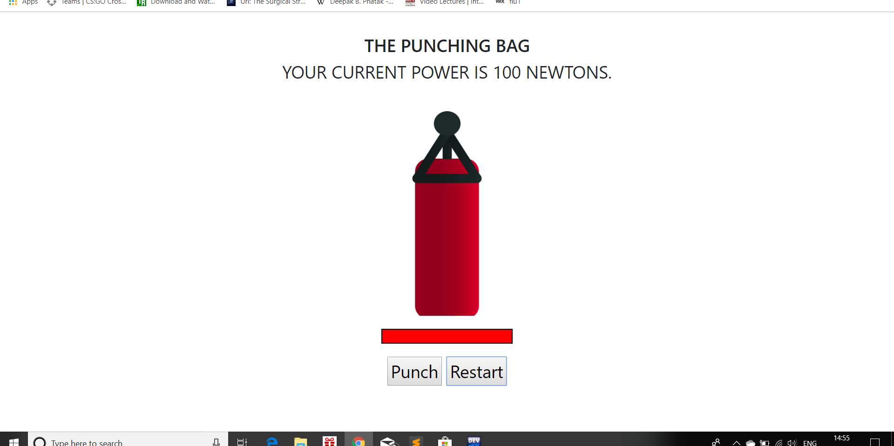

# punchbg-game
It is a simple web game to learn the basics of vue.js framework.

VueJS is a progressive JavaScript framework used to develop interactive web interfaces. Focus is more on the view part, which is the front end. It is very easy to integrate with other projects and libraries. The installation of VueJS is fairly simple, and beginners can easily understand and start building their own user interfaces.

Here is the preview of the webpage:

